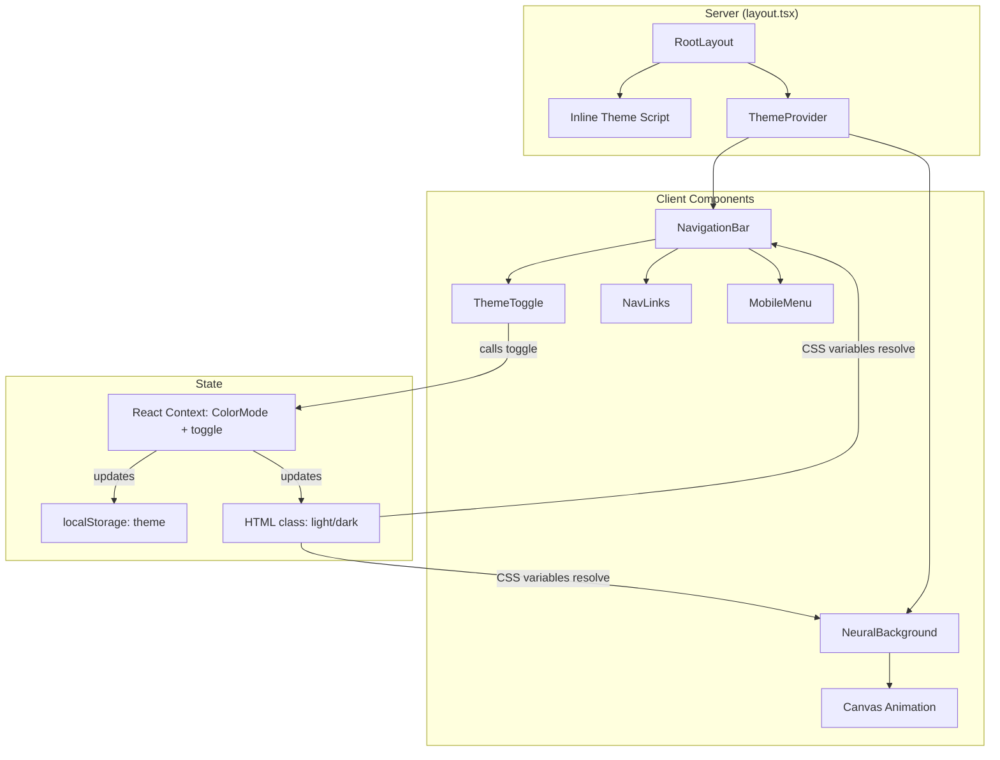
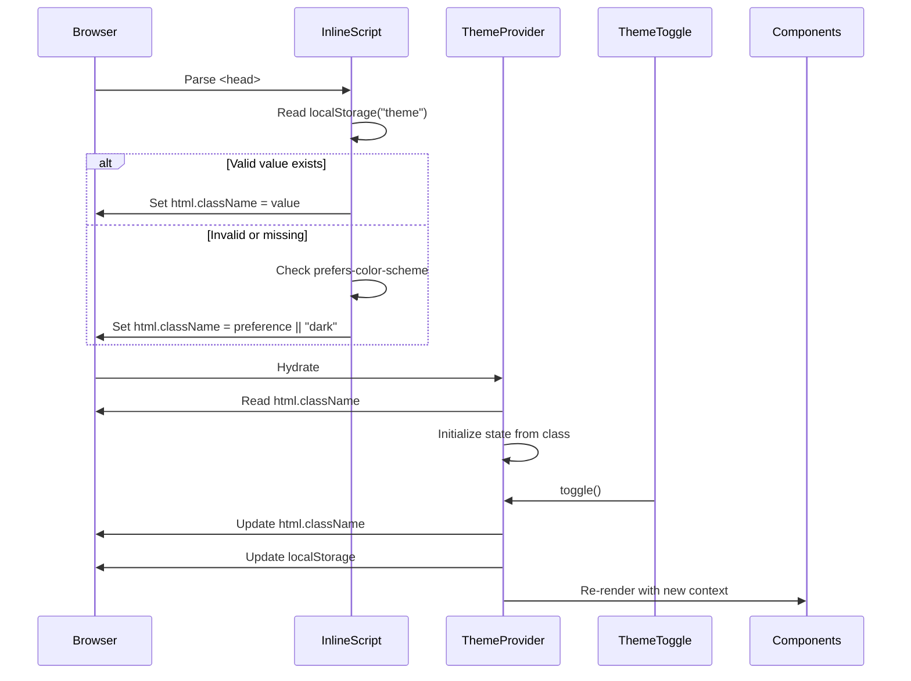

# Design Document: Light Mode and Navigation Bar

## Overview

This design adds a dual-theme system (light/dark) and a fixed navigation bar to the existing Next.js portfolio site. The implementation leverages the existing CSS variable infrastructure in `globals.css`, extends it with a light mode palette, and introduces a `ThemeProvider` context for state management. A flash-prevention inline script ensures the correct theme is applied before first paint. The navigation bar provides section-based smooth scrolling with scroll-spy active link highlighting and responsive mobile support.

### Key Design Decisions

1. **CSS class-based theming** (`.light` / `.dark` on `<html>`) — aligns with the existing Tailwind v4 + shadcn/ui setup and the `@custom-variant dark` already defined in `globals.css`.
2. **React Context for theme state** — lightweight, no external dependency needed (no `next-themes` required since we need fine-grained control over the inline script and NeuralBackground re-render).
3. **Inline `<script>` in layout for FOUC prevention** — runs synchronously before React hydration.
4. **Intersection Observer for scroll-spy** — performant alternative to scroll event listeners for active link detection.
5. **Lenis integration for smooth scroll** — the project already uses Lenis; navigation scroll will use its `scrollTo` API for consistency.

## Architecture



### Data Flow



## Components and Interfaces

### ThemeProvider

**Path:** `src/components/ThemeProvider.tsx`

```typescript
interface ThemeContextValue {
  theme: "light" | "dark";
  toggle: () => void;
}

// React context provider wrapping the app
// Reads initial state from <html> class (set by inline script)
// Exposes theme value and toggle function
```

**Responsibilities:**
- Initialize state by reading the `<html>` element's class attribute
- Toggle between "light" and "dark"
- Update `<html>` class attribute on change
- Persist to `localStorage` with try/catch for unavailable storage
- Provide context to all child components

### ThemeToggle

**Path:** `src/components/ThemeToggle.tsx`

```typescript
interface ThemeToggleProps {
  className?: string;
}

// Button component using lucide-react Sun/Moon icons
// Minimum 44x44px touch target
// aria-label="Toggle color mode"
// Consumes ThemeContext
```

### NavigationBar

**Path:** `src/components/NavigationBar.tsx`

```typescript
interface NavLink {
  label: string;
  href: string; // e.g., "#hero", "#skills", "#projects"
}

interface NavigationBarProps {
  links: NavLink[];
}

// Fixed position, max-h-16, z-50
// Backdrop blur + semi-transparent background
// Contains: home link (left), nav links (center), ThemeToggle (right)
// Responsive: hamburger menu below 768px
```

**Sub-components:**
- `MobileMenu` — slide-down menu for mobile viewports, closes on link click / outside click / Escape
- `NavLinks` — desktop horizontal link list with active state styling

### useScrollSpy Hook

**Path:** `src/hooks/useScrollSpy.ts`

```typescript
function useScrollSpy(sectionIds: string[], offset?: number): string | null;

// Uses IntersectionObserver with rootMargin to detect which section
// is closest to the top of the viewport (within 100px threshold)
// Returns the id of the currently active section
```

### Inline Theme Script

**Location:** Injected in `src/app/layout.tsx` via `<script dangerouslySetInnerHTML>`

```javascript
// Synchronous script that:
// 1. Reads localStorage.getItem("theme")
// 2. Validates value is "light" or "dark"
// 3. Falls back to matchMedia("(prefers-color-scheme: dark)").matches
// 4. Defaults to "dark" if neither available
// 5. Sets document.documentElement.className to the resolved value
```

### NeuralBackground Updates

The existing `NeuralBackground` component reads `--primary` once on mount. It needs to:
1. Listen for theme changes (class mutation on `<html>` or a re-render trigger)
2. Re-read `getComputedStyle(document.body).getPropertyValue("--primary")` when theme changes
3. Use the new color for subsequent animation frames

**Approach:** Use a `MutationObserver` on `document.documentElement` watching for `class` attribute changes, or consume the theme context and re-initialize the color on theme change via a `useEffect` dependency.

## Data Models

### Theme State

```typescript
type ColorMode = "light" | "dark";

interface ThemeState {
  theme: ColorMode;
}
```

### localStorage Schema

- **Key:** `"theme"`
- **Value:** `"light" | "dark"` (string literal)
- **Validation:** Any value not exactly `"light"` or `"dark"` is discarded

### Navigation Configuration

```typescript
interface NavLink {
  label: string;
  href: string;   // Anchor reference, e.g., "#skills"
  sectionId: string; // DOM id without #, e.g., "skills"
}

const NAV_LINKS: NavLink[] = [
  { label: "Home", href: "#hero", sectionId: "hero" },
  { label: "Skills", href: "#skills", sectionId: "skills" },
  { label: "Projects", href: "#projects", sectionId: "projects" },
];
```

### CSS Variable Palette (Light Mode Addition)

```css
.light {
  --background: oklch(0.98 0.002 260);
  --foreground: oklch(0.145 0.005 260);
  --card: oklch(0.96 0.002 260);
  --card-foreground: oklch(0.145 0.005 260);
  --popover: oklch(0.98 0.002 260);
  --popover-foreground: oklch(0.145 0.005 260);
  --primary: oklch(0.45 0.15 160);
  --primary-foreground: oklch(0.98 0.002 260);
  --secondary: oklch(0.93 0 0);
  --secondary-foreground: oklch(0.145 0.005 260);
  --muted: oklch(0.93 0 0);
  --muted-foreground: oklch(0.45 0 0);
  --accent: oklch(0.45 0.15 160);
  --accent-foreground: oklch(0.98 0.002 260);
  --destructive: oklch(0.57 0.245 27.3);
  --destructive-foreground: oklch(0.98 0.002 260);
  --border: oklch(0.88 0.005 260);
  --input: oklch(0.88 0.005 260);
  --ring: oklch(0.45 0.15 160);
}
```

## Correctness Properties

*A property is a characteristic or behavior that should hold true across all valid executions of a system — essentially, a formal statement about what the system should do. Properties serve as the bridge between human-readable specifications and machine-verifiable correctness guarantees.*

### Property 1: Toggle state alternation

*For any* sequence of N toggle operations starting from an initial Color_Mode, the resulting Color_Mode SHALL be the opposite of the initial value when N is odd, and equal to the initial value when N is even.

**Validates: Requirements 1.1, 4.4**

### Property 2: Toggle persistence and DOM synchronization

*For any* sequence of toggle operations, after each toggle completes, both `localStorage.getItem("theme")` and `document.documentElement.className` SHALL equal the current Color_Mode value.

**Validates: Requirements 1.3, 1.5**

### Property 3: Invalid localStorage value rejection

*For any* string value stored in localStorage under the key "theme" that is not exactly "light" or "dark", the Theme_Provider (and inline script) SHALL discard the value and resolve the Color_Mode from the user's System_Preference (or default to "dark" if unavailable).

**Validates: Requirements 1.6, 7.4**

### Property 4: Navigation link-section correspondence

*For any* navigation link rendered in the Navigation_Bar, its `href` attribute value (without the `#` prefix) SHALL correspond to an existing `id` attribute on a section element in the DOM.

**Validates: Requirements 6.2**

### Property 5: Scroll-spy active link correctness

*For any* scroll position on the page, the Navigation_Bar SHALL highlight exactly one link — the link whose corresponding section's top edge is closest to or within 100px below the top of the viewport (offset by the navbar height).

**Validates: Requirements 6.3**

## Error Handling

| Scenario | Handling |
|----------|----------|
| `localStorage` unavailable (private browsing, quota exceeded) | ThemeProvider catches the error, operates in memory-only mode using System_Preference as initial value. No persistence. |
| Invalid `localStorage` value | Discard value, fall back to System_Preference → "dark" default. |
| `matchMedia` unsupported | Default to "dark" mode. |
| `IntersectionObserver` unsupported | Scroll-spy degrades gracefully — no active link highlighting, navigation still works. |
| Section `id` missing from DOM | Navigation link scrolls to top (fallback behavior). Console warning in development. |
| Lenis not initialized | Fall back to native `element.scrollIntoView({ behavior: "smooth" })`. |
| Canvas `getContext("2d")` returns null | NeuralBackground renders children without animation (existing behavior). |

## Testing Strategy

### Unit Tests (Example-Based)

- **ThemeProvider initialization**: Verify correct initial state for all combinations of localStorage × System_Preference (Requirements 1.2, 1.4, 7.2, 7.3, 7.5)
- **Light mode CSS variables**: Verify all specified oklch values and contrast ratios (Requirements 2.1–2.7)
- **Component theme adaptation**: Verify SkillsShowcase and ProjectExperience use CSS variable classes instead of hardcoded colors (Requirements 3.1, 3.2, 3.4)
- **ThemeToggle rendering**: Verify correct icon display per mode, accessible label, target size (Requirements 4.2, 4.3, 4.5, 4.6)
- **NavigationBar structure**: Verify fixed positioning, links present, responsive hamburger behavior (Requirements 5.1–5.8)
- **Scroll offset**: Verify scroll target accounts for navbar height (Requirement 6.4)
- **Menu close triggers**: Verify hamburger closes on link click, outside click, Escape (Requirement 5.7)

### Property-Based Tests

**Library:** [fast-check](https://github.com/dubzzz/fast-check) (JavaScript/TypeScript PBT library)

**Configuration:** Minimum 100 iterations per property test.

Each property test is tagged with:
**Feature: light-mode-and-navbar, Property {number}: {property_text}**

| Property | Test Approach |
|----------|---------------|
| 1: Toggle alternation | Generate random positive integers N, apply N toggles, verify final state matches parity |
| 2: Persistence + DOM sync | Generate random toggle sequences (1–50 toggles), verify localStorage and html class after each |
| 3: Invalid value rejection | Generate arbitrary strings (excluding "light"/"dark"), set in localStorage, initialize provider, verify fallback |
| 4: Link-section correspondence | Generate random subsets of nav links, render page, verify each href resolves to an existing DOM id |
| 5: Scroll-spy correctness | Generate random scroll positions within page bounds, verify the highlighted link matches the expected section |

### Integration Tests

- **Theme transition timing**: Toggle theme and verify all components update within 500ms (Requirement 3.5)
- **NeuralBackground color update**: Change theme and verify canvas uses new `--primary` value (Requirement 3.3)
- **Smooth scroll behavior**: Click nav link and verify scroll completes within 300–800ms (Requirement 6.1)
- **FOUC prevention**: Verify inline script exists in `<head>` and applies class before body renders (Requirement 7.1)

### Accessibility Tests

- Contrast ratio verification for all text/background pairings in both modes (Requirement 2.6)
- Keyboard navigation through navbar and toggle (Requirements 4.5, 5.8)
- ARIA attributes on hamburger menu (Requirement 5.8)
- Focus indicator visibility (Requirements 4.5, 5.8)
